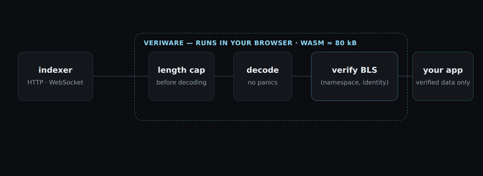

# veriware

[](https://github.com/andreacarotti9/veriware/actions/workflows/ci.yml)

Verify [commonware](https://commonware.xyz) threshold-simplex consensus
certificates in the browser. [alto](https://alto.commonware.xyz) included.

A threshold-simplex network is identified by two values: the namespace its
validators prefix to every signed message, and the threshold public key their
signatures recover to. Give veriware that pair and it will tell you whether a
seed, a notarization or a finalization really came from that network - with no
server to trust and no cryptography of its own.

```bash
npm install veriware
```

## Don't trust the indexer

Anything that shows chain data - a dapp, an explorer, a dashboard - has two
options. The widely adopted one is to fetch from an indexer or an RPC provider
and believe it: nothing to ship, nothing to sync, and it works right up until
the endpoint is compromised or dishonest - at which point it shows your users
whatever it likes, and nothing in the page can tell.

The other option is to verify, and it is rare because it used to be expensive:
on Ethereum it means embedding a light client such as
[Helios](https://github.com/a16z/helios), following sync committees, and
waiting for it to sync, so almost nobody does.



Threshold-simplex removes the expense. The network's threshold key is one fixed
96-byte value, so checking a certificate is a single stateless signature
verification: no headers to follow, no state to sync, nothing to store.
veriware runs that check in the page, which demotes the indexer to a courier.
It can withhold data or serve stale data - see
[What this is not](#what-this-is-not) - but nothing it forges gets past the
callback.

## Verify a certificate

```ts
import { init, networks, verifyFinalized } from 'veriware';

await init();

const result = verifyFinalized(bytes, networks.alto);
if (result.ok) console.log('final at height', result.decoded.block.height);
```

Nothing throws for bad input. Every entry point returns
`{ ok: true, decoded } | { ok: false, error: { code, message } }`, so `if
(!result.ok)` is the only control flow there is.

## Follow the chain, in a page

```html
<script type="module">
  import { AltoIndexerClient, init, networks } from 'https://esm.sh/veriware@0.1.0';

  await init();

  const client = new AltoIndexerClient({
    url: 'https://global.alto.exoware.xyz',
    network: networks.alto,
  });

  // Every frame is verified against alto's threshold key before it arrives
  // here. A forgery never reaches this callback.
  client.subscribe((block, info) => {
    document.title = `height ${block.block.height} · ${info.verifiedInMs.toFixed(1)}ms`;
  });
</script>
```

No bundler, no build step, no runtime dependencies. `fetch` and `WebSocket` are
platform features.

## Any threshold-simplex chain

alto is a preset, not a special case:

```ts
import { defineNetwork, fromHex, verifyFinalization } from 'veriware';

const mine = defineNetwork({
  namespace: '_MYCHAIN',
  identity: fromHex('a6ad67a9...'), // 96-byte BLS12-381 G2 threshold key
});

verifyFinalization(bytes, mine);
```

The conformance fixtures include a certificate that fails against alto and
verifies against its own network, so this is a tested property rather than a
claim.

## How conformance is enforced

**No cryptography was written for this package.** The Rust core depends on the
published [`alto-types`](https://crates.io/crates/alto-types) crate and calls
its verification paths, which call commonware's. The BLS12-381 variant, the
hash-to-curve domain separation tag, the message encodings, the namespace
derivation - all of it is upstream's, compiled to WebAssembly. Conformance is a
property of that delegation, not of a code review.

**The fixtures are the contract.** `fixtures/vectors.json` holds valid
certificates and a tampered variant for every way one can be wrong: a real
signature from another round, a finalization's vote signature spliced into a
notarization, a genuine certificate stapled to a different real block, a
truncation, a payload over the size cap. The Rust suite and the TypeScript suite
run the same file and must agree on accept, reject **and error code**.
Regenerating is deterministic; a diff fails CI.

**Every byte from outside is treated as hostile.** Payloads are length-capped
before decoding. No path reachable from the API panics, since a panic in
WebAssembly poisons the module instance for the rest of the page. Failures are
typed values with stable codes, never thrown and never `null`.

## Size

Measured at 0.1.0, not promised:

| Artifact | brotli | gzip | raw |
|---|---|---|---|
| `veriware_bg.wasm` | 80.4 kB | 102.4 kB | 266.0 kB |
| JavaScript (glue + wrapper) | 13.3 kB | 13.7 kB | 52.7 kB |

Most of it is BLS12-381: pairing-friendly curve arithmetic has a floor, and
`alto-types` reaches the same one. `just ci` prints the current number and fails
if it grows past the budget.

## What this is not

- **Not a light client.** Verifying a finalization proves the certificate is
  real. It does not prove that it is the newest one, that the chain is live, or
  that you are not being shown a stale view. A Helios-style client tracks the
  chain's head to close that gap; veriware trades recency for a stateless
  check.
- **Not an execution verifier.** Application state is out of scope; this checks
  consensus certificates.
- **Not a wallet.** It signs nothing and holds no keys.
- **Epoch 0 only.** Alto pins epoch 0 and never reshares, so identities do not
  rotate. A network that does reshare needs identity rotation, which v1 does not
  implement.
- **ESM only.** No CommonJS build. Node ≥ 20 and evergreen browsers.

## API

`docs/api.md` is the reference. In brief:

| | |
|---|---|
| `init(source?)` | Load the WASM. Explicit, idempotent, no top-level await. |
| `verifySeed` `verifyNotarization` `verifyFinalization` | Bare certificates - the generic layer. |
| `verifyNotarized` `verifyFinalized` | Certificate plus alto block - what alto's endpoints serve. |
| `decodeSeed` ... `decodeBlock` | What a payload *claims*, unverified. For explaining a rejection. |
| `defineNetwork` `networks` | `(namespace, identity)`, and presets for alto's clusters. |
| `AltoIndexerClient` | `fetch` + `WebSocket`, verifying everything it returns. |
| `toHex` `fromHex` | Conveniences. Bytes are `Uint8Array` everywhere. |

Consensus counters are `bigint`. A view or a height is an attacker-controlled
`u64` and passes `Number.MAX_SAFE_INTEGER` long before `u64` runs out; rounding
a verified value silently would be worse than making you write `2n`.

## Demo

```bash
just demo   # http://localhost:8000/demo/
```

Live finality with per-certificate verification latency, falling back to fixture
replay when no indexer answers.

## Development

```bash
just ci     # lint, fixture check, tests, dependency check, size report
just test   # Rust and TypeScript suites
just smoke  # pack, install into a scratch project, run the offline example
```

macOS needs `brew install llvm` to build the WASM - Apple's clang has no
WebAssembly backend. See `docs/versions.md`.

`CONTRIBUTING.md` has the rules worth knowing before changing anything;
`docs/decisions.md` records why things are the way they are.

## Credit

In-browser verification of alto certificates was pioneered by the **alto
explorer**, which compiles `alto-types` to WebAssembly and verifies certificates
client-side today. veriware packages that capability as a versioned, documented
npm module, generalizes it beyond alto, and adds a browser client the ecosystem
did not have. The hard part - the cryptography and the consensus protocol - is
Commonware's.

Not affiliated with or endorsed by Commonware, Inc.

## License

MIT OR Apache-2.0.
